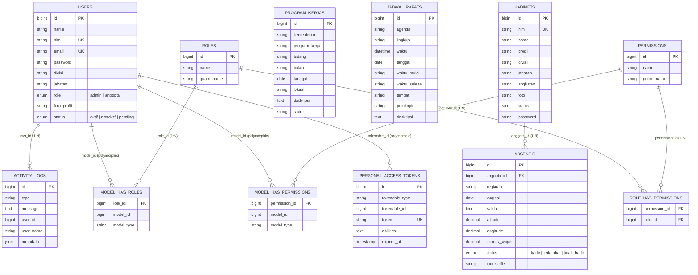

# ERD BEM Dashboard

```mermaid
erDiagram
    USERS {
        bigint id PK
        string name
        string nim UK
        string email UK
        string password
        string divisi
        string jabatan
        enum role "admin | anggota"
        string foto_profil
        enum status "aktif | nonaktif | pending"
    }

    KABINETS {
        bigint id PK
        string nim UK
        string nama
        string prodi
        string divisi
        string jabatan
        string angkatan
        string foto
        string status
        string password
    }

    ABSENSIS {
        bigint id PK
        bigint anggota_id FK
        string kegiatan
        date tanggal
        time waktu
        decimal latitude
        decimal longitude
        decimal akurasi_wajah
        enum status "hadir | terlambat | tidak_hadir"
        string foto_selfie
    }

    PROGRAM_KERJAS {
        bigint id PK
        string kementerian
        string program_kerja
        string bidang
        string bulan
        date tanggal
        string lokasi
        text deskripsi
        string status
    }

    JADWAL_RAPATS {
        bigint id PK
        string agenda
        string lingkup
        datetime waktu
        date tanggal
        string waktu_mulai
        string waktu_selesai
        string tempat
        string pemimpin
        text deskripsi
    }

    ACTIVITY_LOGS {
        bigint id PK
        string type
        text message
        bigint user_id
        string user_name
        json metadata
    }

    PERSONAL_ACCESS_TOKENS {
        bigint id PK
        string tokenable_type
        bigint tokenable_id
        string token UK
        text abilities
        timestamp expires_at
    }

    ROLES {
        bigint id PK
        string name
        string guard_name
    }

    PERMISSIONS {
        bigint id PK
        string name
        string guard_name
    }

    MODEL_HAS_ROLES {
        bigint role_id FK
        bigint model_id
        string model_type
    }

    MODEL_HAS_PERMISSIONS {
        bigint permission_id FK
        bigint model_id
        string model_type
    }

    ROLE_HAS_PERMISSIONS {
        bigint permission_id FK
        bigint role_id FK
    }

    %% ─── RELATIONSHIPS ───

    KABINETS ||--o{ ABSENSIS : "anggota_id (1:N)"
    USERS  ||--o{ ACTIVITY_LOGS : "user_id (1:N)"

    %% Spatie Permission relationships
    USERS ||--o{ MODEL_HAS_ROLES : "model_id (polymorphic)"
    USERS ||--o{ MODEL_HAS_PERMISSIONS : "model_id (polymorphic)"
    ROLES ||--o{ MODEL_HAS_ROLES : "role_id (1:N)"
    PERMISSIONS ||--o{ MODEL_HAS_PERMISSIONS : "permission_id (1:N)"
    ROLES ||--o{ ROLE_HAS_PERMISSIONS : "role_id (1:N)"
    PERMISSIONS ||--o{ ROLE_HAS_PERMISSIONS : "permission_id (1:N)"

    %% Sanctum (polymorphic, biasanya ke USERS)
    USERS ||--o{ PERSONAL_ACCESS_TOKENS : "tokenable_id (polymorphic)"
```
